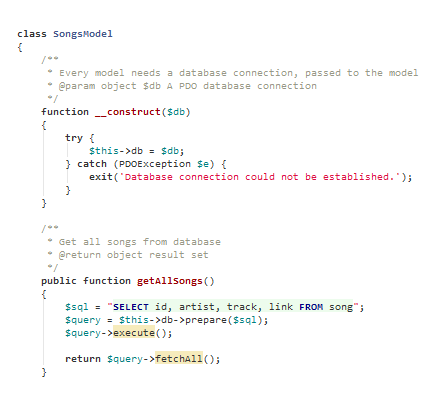

# GeneaLab's phpstorm-theme-github-remixed

I really like working with this theme, and have made some minor font and color adjustments, the most notable being setting the background color to a light gray, instead of the default PHPStorm white.

Get GitHub's syntax highlighting / color scheme and fonts within PHPStorm. In this theme I tried to be as close as
possible on the original GitHub PHP colours, but switched the red comments (seriously GitHub, RED? :)) to a decent grey.
The theme contains also basic colours for JS, HTML, CSS etc. and uses - exactly like GitHub - the `Consolas` font
which is installed by default on Windows systems and can be downloaded for free for Mac OS and Linux.
This is an experimental repo, not sure if this looks like it should look everywhere on every platform.

### Installation on Windows (PHPStorm 8)

Close PHPStorm if open.
Go to `C:\Users\XXXXXX\.WebIde80\config\colors` and place the .icls file there.
Open PHPStorm, go to *View -> Quick Switch Theme -> Switch Color Scheme* and select *GitHub Remixed*.

### Installation on Mac OS (PHPStorm 8)

Same as above, but path is `~/Library/Preferences/WebIde80/colors/`.

### Installation on Linux (PHPStorm 8)

Same as above, but path is `~/Library/Preferences/WebIde80/colors`.
